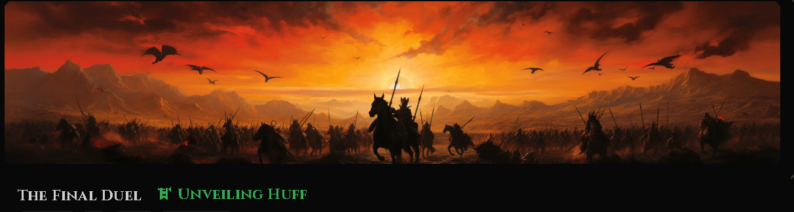

<br/>

I finally reached the end of the **"Unveiling Huff"** campaign on [Node Guardians](https://nodeguardians.io). After battling linear dispatchers and optimization puzzles, I faced the final boss: **The Dark Huffoor**.

The setup was classic RPG: The boss casts a `darkSpell` (a random `bytes32` hash). To survive, I had to deflect it by casting a `counterSpell`.

The catch? The `counterSpell` had to be the exact **Bitwise Reverse** of the `darkSpell`.
Oh, and I had a hard gas limit of **1,800 gas**.

### But What is Bit traversal sir ?
Bitwise reversal is the process of `completely mirroring the binary representation of a number in opposite order`.

Imagine the bits are written on a piece of transparent paper. "Reversing the bits" is like flipping that paper over horizontally:

> The `First` bit of input becomes the `Last` bit of output.

> The `Last` bit of input becomes the `First` bit of output.

> Everything in the `middle` is swapped to its `mirror` position.


#### Take example from tests

dark spell       : `0x61c831beab28d67d1bb40b5ae1a11e2757fa842f031a2d0bc94a7867bc5d26c2`
counter spell    : `0x4364ba3de61e5293d0b458c0f4215feae47885875ad02dd8be6b14d57d8c1386`

Look at the start nibble of Input , `0x61 = 0110 0001` (`cast to-base 0x61 bin`) , reverse it `1000_0110` = `134` in decimals = `0x86` in hex , see `last` byte `86` of `output`

Now `last` bit of input `0xc2` = `11000010` , reverse it -> `01000011` = `0x43` ( start of output `43`)


## The Trap: Why Solidity Fails Here

If you were writing this in Solidity, your first instinct might be to use a loop.

```solidity
function reverse(uint256 input) internal pure returns (uint256 reversed) {
    for (uint256 i = 0; i < 256; i++) {
        // Extract bit at i, move to (255 - i)...
        if ((input >> i) & 1 == 1) {
            reversed |= 1 << (255 - i);
        }
    }
}

```

Mathematically, this is **O(n)** complexity.

* **Iterations:** 256
* **Cost per iteration:** ~20-40 gas (optimistically)
* **Total Cost:** **~5,000 - 10,000 gas**

With an `1,800` gas limit, a loop is dead on arrival. I needed a way to reverse 256 bits in **O(1)** (constant time).

## The Magic: The Butterfly Algorithm ( Thanks my AI buddy + Brain )

The solution lies in a technique in Computer science we call the **Divide and Conquer** but for bit shifting let's call it `Butterfly` method. Instead of moving bits one by one, we swap **chunks** of bits in parallel.

The strategy takes only **8 steps** (because ):

To reverse bits in `O(1)` time (constant gas), we use the `"Butterfly"` method.

Instead of looping `256 times`, we swap chunks of bits in parallel. (Generated using `script/GenerateMasks.s.sol`)

These constants act as filters to select specific chunks.

|Label|Hex represenation|Binary representation| Description|
|----|--|--|---|
|M1|    0x5555...| 0101...|                                                  make Every Odd bit (1, 3, 5...) 1 |
|M2|    0x3333...|00110011...|                                                   Alternate 2-bit pairs |
|M4|    0x0F0F...|0000111100001111....|                                               Alternate Nibbles (4-bits) |
|M8|    0x00FF...|00000000111111110000000011111111...|                                      Alternate Bytes (8-bits) |
|M16|0x0000FFFF...|"00...0011...11 (16 zeros, 16 ones)"|             Alternate 2-Byte words|
|M32|0x00000000FFFFFFFF...|"00...0011...11 (32 zeros, 32 ones)"|     Alternate 4-Byte words|
|M64|0x0000000000000000ffffffffffffffff...|"00...0011...11 (64 zeros, 64 ones)"|                       Alternate 8-Byte words|
|M128|0x00000000000000000000000000000000ffffffffffffffffffffffffffffffff|"00...0011...11 (128 zeros, 128 ones)"|                    The Lower 128 bits|

#### The Mask generation foundry script `GenerateMasks.s.sol`

```solidity
// SPDX-License-Identifier: MIT
pragma solidity ^0.8.19;

import "forge-std/Script.sol";
import "forge-std/console.sol";

contract GenerateMasks is Script {
    function run() external view {
        console.log("// Paste this into your Huff file");
        console.log("// Generated by script/GenerateMasks.s.sol\n");

        printMask("M1", 1);
        printMask("M2", 2);
        printMask("M4", 4);
        printMask("M8", 8);
        printMask("M16", 16);
        printMask("M32", 32);
        printMask("M64", 64);
        printMask("M128", 128);
    }

    function printMask(string memory name, uint256 blockSize) internal view {
        uint256 mask = 0;

        // Loop through all 256 bits
        for (uint256 i = 0; i < 256; i++) {
            // Determine which "block" we are in.
            // Even blocks get 1s, Odd blocks get 0s.
            // Example M1 (size 1): Block 0->1, Block 1->0, Block 2->1 ...
            uint256 chunkIndex = i / blockSize;
            
            if (chunkIndex % 2 == 0) {
                // Set the bit at position i
                mask |= (1 << i);
            }
        }

        // Output in Huff format
        console.log(string.concat("#define constant ", name, "   = "));
        console.logBytes32(bytes32(mask));
    }
}
```

### The Implementation in Huff

I defined a series of "Magic Masks" to select the chunks we wanted to swap.

* `M1 = 0x55...` (Binary `0101...`) selects every other bit.
* `M2 = 0x33...` (Binary `0011...`) selects pairs.
* `M4 = 0x0F...` (Binary `00001111...`) selects nibbles.

Here is the `REVERSE_BITS` macro that costs only **~150 gas**:


The main operation we see here is `((x & M1) << 1) | ((x >> 1) & M1)`
and later repeated for M2.M3...M128, let's see more in depth what this shifting means in simple language

### Deck of cards reversal

Imagine you have a deck of 8 cards (bits) numbered 0 to 7. You want to reverse them so they read 7 to 0.

**Original:** `[7 6 5 4 3 2 1 0]`

**Step 1: Swap Adjacent Pairs (1-bit swap)**
We want to swap neighbors: `(1,0)`, `(3,2)`, `(5,4)`, `(7,6)`.

* We need a mask that selects every **other** bit to separate them.
* **Pattern:** `0 1 0 1 0 1 0 1`
* **Hex:** `0x55`
* **Action:** Shift the `0`s left and the `1`s right.
* **Result:** `[6 7 4 5 2 3 0 1]` (Neighbors are flipped!)

**Step 2: Swap Adjacent 2-bit Chunks**
Now we treat them as blocks of 2. We want to swap `(45, 67)` and `(01, 23)`.

* We need a mask that selects 2 bits, skips 2 bits.
* **Pattern:** `0 0 1 1 0 0 1 1`
* **Hex:** `0x33`
* **Result:** `[4 5 6 7 0 1 2 3]`

**Step 3: Swap Adjacent 4-bit Nibbles**
Now we swap the left 4 with the right 4.

* Mask selects 4 bits, skips 4 bits.
* **Pattern:** `0 0 0 0 1 1 1 1`
* **Hex:** `0x0F`
* **Result:** `[0 1 2 3 4 5 6 7]` -> **REVERSED!**

### So what this shifting actually does 

Note: It's oky if u don't understand right away. please keep reading , you will get it.

So we see this code here

```    
    dup1                // [x, x]
    [M1] and            // [x & M1, x]            <- Keep even bits
    0x01 shl            // [(x & M1) << 1, x]     <- Move evens to odd positions
    
    swap1               // [x, (x & M1) << 1]
    0x01 shr            // [x >> 1, (x & M1) << 1]
    [M1] and            // [(x >> 1) & M1, (x & M1) << 1] <- Keep original odds (now in even spots)
    
    or                  // [result_step_1]
```

This code has two halves/splits and hence two copies of `x` the number.Output of those two halves is Merged later in final step.

In the `first` half , we `only keep even bits` of number x and `remove the odd bits` from it and later `transfer` those even bits at odd positions in a fresh zero number( having same number of bits as x ) i.e 0x0000

the `second` half with new copy of x , `remove even bits` and `keep odd bits` but later `transfer` them to `even` positions
in a new zero number i.e 0x0000

so we have

> `result1` : events bits moved to odd positions 
> `result2` : odd bits moved to even positions

when we finally `OR` them , we get the complete number Because It is `The Merge`.

i.e
if the number was

`111011` ( intuitively its reverse is `110111`)

first half makes it 
only keep even bits that is 101, then in a new `0x000000` copy number , mves 101 to this number's odd positions making it `0x100010`

second half does opposite takes `111` ( odd digits and removes even bits) then in new copy say 0x000000 moves those `111`(odd digits) at even positions i.e `0x010101`

when we OR both of them 

`0x100010`
`0x010101`

we get `110111` which is correct.


Note: read again if u are not fully confidant on your understanding or talk to an LLM about it . They are good in explanation mostly.

Now this logic was for reversing `1-bit` pairs. 
since uint256 has `256 bits` we have to do it multiple times i.e for

> 1 bit pairs
> 2 bit pairs
> 4 bit pairs
> 8 bit pairs
> 16 bit pairs
> 32 bit pairs
> 64 bit pairs
> 128 bit pairs

and then we stop because numbers are only 256 bits long. Once we do that , the number has already been reversed.

```javascript
#define constant M1   = 0x5555555555555555555555555555555555555555555555555555555555555555
// ... (other constants M2, M4, M8, M16, M32, M64, M128)

#define macro REVERSE_BITS() = takes (1) returns (1) {
    // Input: [x]

        // ---------------------------------------------------------
    // Step 1: Swap adjacent bits (1-bit pairs)
    // ---------------------------------------------------------
    // We want to swap bits 0&1, 2&3, etc.
    // Left Logic:  Take bits at positions 0,2,4... (using M1), shift them LEFT to 1,3,5...
    // Right Logic: Take bits at positions 1,3,5... (shift RIGHT), isolate them (using M1)
    // Result:      Combine them with OR.
    
    dup1                // [x, x]
    [M1] and            // [x & M1, x]            <- Keep even bits
    0x01 shl            // [(x & M1) << 1, x]     <- Move evens to odd positions
    
    swap1               // [x, (x & M1) << 1]
    0x01 shr            // [x >> 1, (x & M1) << 1]
    [M1] and            // [(x >> 1) & M1, (x & M1) << 1] <- Keep original odds (now in even spots)
    
    or                  // [result_step_1]

    // ... (Steps 2 through 7) ...

    // Step 8: Swap 128-bit halves
    dup1 [M128] and 0x80 shl
    swap1 0x80 shr [M128] and or
}

```

## The Full Solution: 3 Moves to Victory

My final `MAIN` macro had to execute a perfect sequence of moves to fit the gas budget.

### 1. The Parry (Selector Check)

The challenge required strict adherence to the interface. If the enemy cast anything other than `takeDamage()`, I had to revert immediately.

* *Cost: ~20 Gas*

### 2. The Steal (Staticcall)

I needed to read the `darkSpell` variable from the boss contract (`msg.sender`). I used a low-level `STATICCALL`, reusing memory slot `0x00` for both the outgoing selector (`0xec24ac76`) and the incoming result to save on memory expansion costs.

Inspiration of static call here : https://ethereum.stackexchange.com/questions/132961/call-another-contract-with-huff

* *Cost: ~120 Gas*

### 3. The Riposte (Bit Reversal)

I ran the `darkSpell` through the `REVERSE_BITS` macro.

* *Cost: ~220 Gas*

## The Result

* **Total Gas Used:** ~894 Gas.
* **Gas Limit:** 1,800 Gas.
* **Status:** **Crushed it.**

Later i realized the `official solution` has used `1600+ gas` and mine was `~900` gas. Man i'm really am levelling up i guess then.


However.This challenge was a potent reminder that **algorithms matter**. In high-level languages like Solidity, we often take `for` loops for granted. But when you are working at the metal, changing your algorithm from  to  isn't just an optimization—it's the difference between "Impossible" and "Easy".

Thanks for reading.

*Now, if you'll excuse me, I have some bitmasks to generate.*


