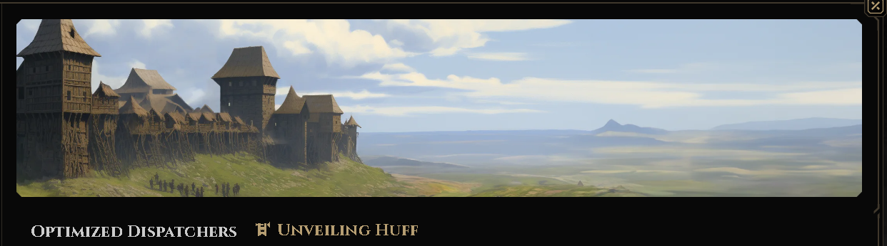

# 140 Gas or Bust: How I Solved the Node Guardians Huff Optimized Dispatchers Challenge


I’ve been diving deep into low-level EVM optimization through the **"Unveiling Huff"** track on [Node Guardians](https://nodeguardians.io/adventure/optimized-dispatchers/part-2). Everything was going good ( a bit rough but managable ) until I hit **Challenge 3: Optimized Dispatchers**.

The quest is split into two parts:
We have to make a dispatch that handles
1. **TownDefenseV1:** A contract with 10 functions.
2. **TownDefenseV2:** A contract with 40 functions... and a **140 gas limit** for the entire transaction.

Part 1 was a cool as I’ve been taking **Cyrin's assembly and formal verification course**, so writing a standard linear dispatcher (checking selectors one by one) was muscle memory. It passed easily and i thought wow , i'm getting good at it.

But Part 2? That was a `different beast`.

## The Wall: When O(n) is not charming anymore

So in part 2 , i also needed to write a dispatcher but this time , a more optimized one.
Given the gas limit on Two test suits.
First `PublicTest1` which has `250` gas limit and the second one was brutal: **140 gas**.

To understand why this is so hard, let's do the math.

In a standard linear dispatcher, the EVM checks function selectors sequentially using a loop of `DUP1`, `PUSH4`, `EQ`, and `JUMPI`.

### The Math Behind the Success of V1 and Failure of V2
A linear dispatcher looks something like this

```javascript

#define macro MAIN() = takes (0) returns (0) {

    // Calldata layout :
    //   0x00..0x03 : function selector (4 bytes)
    //   0x04..0x23 : uint256 arg (32 bytes)
    //
    // Way to do :
    //   1) Read selector
    //   2) Match against __FUNC_SIG(<fnName>) from interface
    //   3) Jump to the corresponding macro in implementation file

    // (1) Extract the 4-byte function selector from calldata

    0x00 calldataload
    0xE0 shr                              // [fn_selector]
    // (2) Dispatch table: selector -> jump target
    
    dup1 __FUNC_SIG(func_interface) eq funcJump jumpi

    funcJump:
        FUNCTION_CALL()
}

```
let's do the math...

* **Setup:** `CALLDATALOAD`, `SHR` (extract selector) ≈ **12 gas**
* **Per Function Check:** `DUP1` (3) + `PUSH4` (3) + `EQ` (3) + `JUMPI` (10) = **19 gas**

**The Cost of Linear Search:**

* **Best Case (1st function):** 12 + 19 = **31 gas** (Passes ✅)
* **Average Case (20th function):** 12 + (20 × 19) = **392 gas** (Fails ❌)
* **Worst Case (40th function):** 12 + (40 × 19) = **772 gas** (Catastrophic Failure ❌)

If a user called the last function in my list, I would burn `5x` my budget just *finding* the code. 

`"This is the moment , i knew , i effed up"`

I needed a dispatcher that cost the same amount of gas whether I was calling Function #1 or Function #40.

## Phase 1: The "Research" Loop

I started where everyone starts: [**Philogy’s** famous article on dispatching](https://philogy.github.io/posts/selector-switches/). I’ll be honest—on the first read, some of it was too technical ( especially the last approaches lol ). It went over my head.

I tried asking `ChatGPT` for help, but it kept giving me generic Solidity optimizations or broken assembly that didn't fit the Huff context. No luck there.

I went back to `Philogy’s` article, forcing myself to understand the concept of **Jump Tables**. I managed to implement a basic one that passed `PublicTest1` (which had a generous 250 gas limit). But as soon as I ran it against the 140 gas limit of `PublicTest2`, it failed.

## Phase 2: The Failed Bit-Shifting Experiment

I thought, `"Okay, I need to be clever."`
I tried to implement a `packed jump table` using `bit-shifting`. My idea was to extract specific nibbles (4-bit chunks) from the function selector to calculate a unique index.

I wrote this macro to map selectors like `0xAABBCCDD` to an index:

```javascript
#define macro SELECTOR_TO_INDEX() = takes(1) returns(1) {
    // selector = 0xAABBCCDD (32-bit value)
    // low  = lowNibble(BB)  = (selector >> 16) & 0x0f
    // high = highNibble(DD) = (selector >>  4) & 0x0f
    // idx  = (high << 4) | low

    // lowNibble(BB)
    dup1
    0x10 shr
    0x0f and        // [low, selector]

    // highNibble(DD)
    swap1
    0x04 shr
    0x0f and        // [high, low]

    0x04 shl
    or              // [idx]
}

```

**The Result:** `InvalidJump`.
Huff is `unforgiving`. Unlike Solidity, which handles jump destinations for you, Huff requires you to manage the Program Counter (PC) manually. My offset calculations were slightly off—likely due to the jump destinations not being exactly 16 bytes aligned etc and execution kept landing in the middle of opcodes.

Without a robust Huff debugger, I was just suffering. I was blindly poking at memory offsets and getting reverted.

## Phase 3: Stepping Back to the Data

I realized I was trying to code my way out of a data problem. I needed to stop guessing and actually look at the 40 function selectors I was dealing with.

I wrote a Bash/Python script to extract the signatures and calculate the selectors myself.

### My `get-selectors.sh` Script

This script parses the Huff/Solidity interface and spits out the 4-byte selectors.

initially only made for huff but later extended for solidity interfaces too , works good for huff , maybe u can use it later :)


```bash
#!/usr/bin/env bash
set -euo pipefail

# Print function selectors for given signatures or interface files.
#
# Usage:
#   ./get-selectors.sh [FILE|SIGNATURE]...
#
# Examples:
#   ./get-selectors.sh
#   ./get-selectors.sh contracts/interfaces/ITownDefenseV2.huff
#   ./get-selectors.sh "foo(uint256,address)" "bar()"
#
# Notes:
# - For Huff, this scans lines with: `#define function name(params)`.
# - For Solidity, this scans single-line `function name(params)` declarations.
# - For complex Solidity formatting (multiline), pass explicit signatures.


die() {
  echo "Error: $*" >&2
  exit 1
}

usage() {
  cat <<'USAGE'
Usage: get-selectors.sh [FILE|SIGNATURE]...

If an argument is a file, parse function signatures from it. Otherwise treat
it as a literal signature string like "foo(uint256,address)".
USAGE
}

if [[ ${1:-} == "-h" || ${1:-} == "--help" ]]; then
  usage
  exit 0
fi

if ! command -v cast >/dev/null 2>&1; then
  die "'cast' not found in PATH. Install Foundry first."
fi

default_file="contracts/interfaces/ITownDefenseV2.huff"

# If no args, fall back to the default interface file.
if [[ $# -eq 0 ]]; then
  if [[ -f "$default_file" ]]; then
    set -- "$default_file"
  else
    die "no inputs provided and default file not found: $default_file"
  fi
fi

# Convert a name + raw params into a normalized signature.
normalize_signature() {
  local name="$1"
  local params="${2:-}"

  if [[ -z "$params" ]]; then
    printf '%s()' "$name"
    return
  fi

  if command -v python3 >/dev/null 2>&1; then
    python3 - "$name" "$params" <<'PY'
import re
import sys

name = sys.argv[1]
params = sys.argv[2]

# Split params by commas outside of nested parentheses.
items = []
depth = 0
buf = []
for ch in params:
    if ch == ',' and depth == 0:
        items.append(''.join(buf).strip())
        buf = []
        continue
    if ch == '(':
        depth += 1
    elif ch == ')':
        depth = max(depth - 1, 0)
    buf.append(ch)
if buf:
    items.append(''.join(buf).strip())

# Strip names and data-location keywords to produce type-only params.
def clean_param(p: str) -> str:
    if not p:
        return ''
    p = re.sub(r'\b(memory|calldata|storage|indexed)\b', '', p)
    p = re.sub(r'\s+', ' ', p).strip()
    if not p:
        return ''

    depth = 0
    last_space = None
    for i, ch in enumerate(p):
        if ch == '(':
            depth += 1
        elif ch == ')':
            depth = max(depth - 1, 0)
        elif ch.isspace() and depth == 0:
            last_space = i

    if last_space is not None:
        p = p[:last_space].strip()
    return p

cleaned = [clean_param(p) for p in items if p.strip()]
cleaned = [p for p in cleaned if p]

print(f"{name}({','.join(cleaned)})")
PY
    return
  fi

  # Fallback: basic parsing if python3 isn't available.
  local cleaned
  cleaned="$(echo "$params" | sed -E 's/\b(memory|calldata|storage|indexed)\b//g' | tr -s ' ' | sed -E 's/^ *//; s/ *$//')"
  local out=()
  IFS=',' read -r -a parts <<< "$cleaned"
  for p in "${parts[@]}"; do
    p="$(echo "$p" | sed -E 's/^ *//; s/ *$//')"
    [[ -z "$p" ]] && continue
    # Keep the type token only; this is best-effort for simple params.
    out+=("${p%% *}")
  done
  local joined
  joined=$(IFS=','; echo "${out[*]}")
  printf '%s(%s)' "$name" "$joined"
}

# Extract signatures from a file (Huff or Solidity).
extract_from_file() {
  local file="$1"
  awk '
    /^[[:space:]]*\/\// { next }
    /#define[[:space:]]+function/ {
      match($0, /#define[[:space:]]+function[[:space:]]+([A-Za-z0-9_]+)[[:space:]]*\(([^)]*)\)/, m)
      if (m[1] != "") print m[1] "|" m[2]
      next
    }
    /[[:space:]]function[[:space:]]/ {
      match($0, /function[[:space:]]+([A-Za-z0-9_]+)[[:space:]]*\(([^)]*)\)/, m)
      if (m[1] != "") print m[1] "|" m[2]
    }
  ' "$file"
}

signatures=()

for arg in "$@"; do
  if [[ -f "$arg" ]]; then
    while IFS='|' read -r name params; do
      [[ -z "$name" ]] && continue
      signatures+=("$(normalize_signature "$name" "$params")")
    done < <(extract_from_file "$arg")
  else
    signatures+=("$arg")
  fi
done

if [[ ${#signatures[@]} -eq 0 ]]; then
  die "no function signatures found"
fi

for sig in "${signatures[@]}"; do
  selector="$(cast sig "$sig")"
  printf '%s: %s\n' "$sig" "$selector"
done

```

Running this gave me the raw list of selectors

i.e if you have a huff interface file 

```c
#define function callReinforcements1() view returns ()
#define function callReinforcements2() view returns ()
#define function callReinforcements3() view returns ()
#define function callReinforcements4() view returns ()

```

it will generate following output:

```bash
callReinforcements1(): 0x972aa689
callReinforcements2(): 0x501e2751
callReinforcements3(): 0x32ce1a78
callReinforcements4(): 0x93f41d8a
```

thank me man :)

moving on...

## Phase 4: Finding the Perfect Mask

I needed a **"Perfect Hash"**—a cheap operation to map these 40 random hex strings into a table , a unique identifier based table ... might be around size 40 or what ( tried later and found different number below )

I experimented with my AI buddy, trying different bitmasks via trial and error:

* `Selector & 0xFF` (Last 8 bits)? Too large, too many collisions.
* `Selector % 77`? Modulo is too expensive (gas-wise).


And then it clicked...

We found that `Selector & 0x3F` (the last 6 bits, decimal 63) was the "Goldilocks" mask. It mapped all 40 selectors into 64 slots with very few collisions.

## Phase 5: The Final Architecture (The Solution)

with the `0x3F` mask, I built the final solution.

### My Approach

1. **Extract** the selector.
2. **Mask** it with `0x3F` (Cost: 3 gas).
3. **Calculate Offset**: Multiply by 32 bytes (`0x20`).
4. **Load Code**: Use `CODECOPY` to pull the jump destination from a data table.
5. **Jump**: Teleport straight to the function logic.

### The Code

Here is the final ( intentionally incomplete ) `MAIN` macro that crushed the 140 gas limit:

```javascript

#define macro MAIN() = takes (0) returns (0) {
    0x00 calldataload 0xe0 shr          // [sel]

    // Index = sel & 0x3F
    dup1 0x3f and                       // [index, sel]
    0x20 mul                            // [offset, sel]

    // Load destination from DISPATCH table
    0x20                                // [size, offset, sel]
    swap1 __tablestart(DISPATCH) add    // [src, size, sel]
    0x00                                // [dest_mem, src, size, sel]
    codecopy                            // [sel]

    // Jump to the handler
    0x00 mload jump                     

    error: 0x00 0x00 revert

    // COLLISION HANDLERS 
    // If multiple selectors share the same last 6 bits, we jump here first.
    c_0a: 
        dup1 0x64ca1d0a eq tf3_j jumpi
        dup1 0x93f41d8a eq cr4_j jumpi
        error jump
    
    // ... (other collision handlers) ...

    // VALIDATED LEAF NODES
    // Check the FULL selector to prevent spoofing
    // intentionally left psuedocode so that u do the homework first ... shoot me a dm and i can provide it to u
    tf3_j: check selector matches with 0x64ca1d0a , and route to the jump
    cr4_j: check selector matches with 0x93f41d8a , and route to the jump
    // ... (remaining functions) ...
}

#define jumptable DISPATCH {
    rb4_j os4_j error error error error rw1_j error
    sc4_j cr1_j c_0a error c_0c lc1_j error error
    // ... (rest of the table) ...
}

```

## Why This Works

Unlike V1, this solution runs in **O(1) Constant Time**.

* **Setup & Masking:** `CALLDATALOAD`, `SHR`, `AND` etc. = **~21 gas**
* **Table Logic:** `MUL`, `ADD`, `CODECOPY`, `MLOAD` = **~29 gas**
* **The Jump:** `JUMP` = **8 gas**
* **Final Verification:** `EQ`, `JUMPI` = **19 gas**

**Total V2 Cost:** ~**77 - 83 gas** for *any* function.

Note: please correct me if the estimation is wrong but it clearly passes 140 gas limit :)

This leaves me with **~57 gas** of breathing room before hitting the 140 limit—plenty of space for the game logic.

## Conclusion

This puzzle was a rollercoaster. It started with me feeling confident, then feeling stupid reading technical blogs, then suffering through broken bit-shifting macros.

But the breakthrough didn't come from better coding—it came from **analyzing the data**. By finding that `0x3F` mask, I turned a complex search problem into a simple lookup, dropping the gas cost from ~300 to ~80.

Now that the Town is defended, only one challenge remains: **The Final Duel with the Dark Huffoor.**